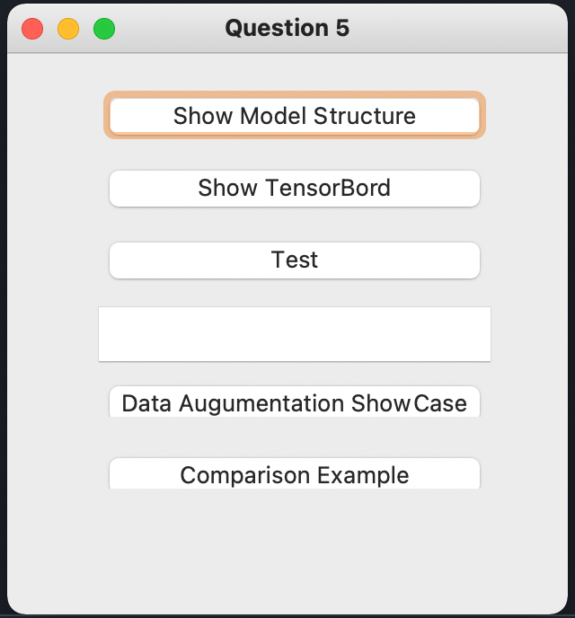

# Dog Cat Classifier


## Download Dataset
from [here](https://www.kaggle.com/c/dogs-vs-cats/data)!

## Repository Structure
```
┌── requirements.txt
├── test/
│   ├── ...
|   └── .jpg
├── train/
|   ├── cat/
│   │   ├── ...
|   │   └── .jpg
│   └── dog/
│       ├── ...
|       └── .jpg
├── models/
├── dataset.py
├── infer.py
├── main.py
├── random_erasing.py
└── train.py
```

## Open GUI
```bash=
python main.py
```


## Training Model
```bash=
python train.py
```
- We use ResNet50 as pretrained model.

## Random Erasing Showcase
[check here](examples/random_erasing_showcase.ipynb)


## Tensorboard
